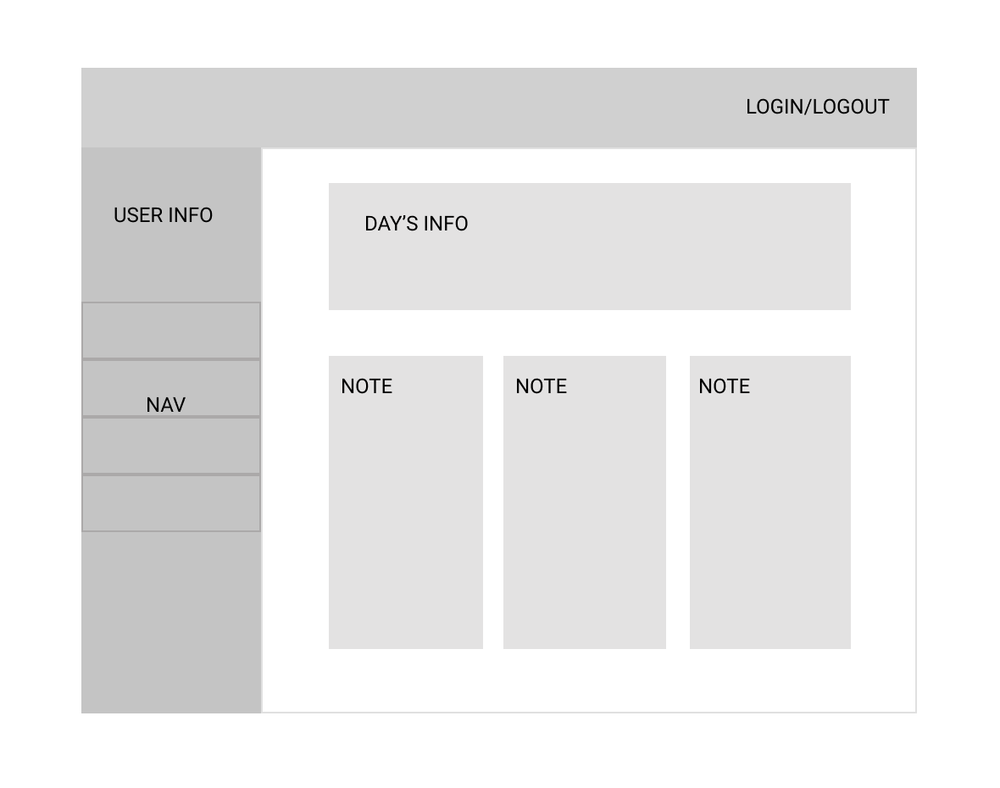

# Project 2 Planning

Fork & Clone this repo.

## Part 1

Review the [Project 2 requirements](https://romebell.gitbook.io/sei-1019/projects/project-2) and check out some [examples](https://tmdarneille.gitbook.io/seirfx/11-projects/past-projects/project2).

In this space below, list **THREE** ideas for your Project 2. For each idea, include [user stories](https://revelry.co/user-stories-that-dont-suck/) for each idea and a link to the API(s) you want to use for it.

--------------------------------------------------------
(In order of most want to work on to least)

1. Period Tracker

    As a user, I want to be able to reliably track my period and its symptoms.  I want to be able to see trends and the prediciton my upcoming date. As a user, I want to be able to choose which information is important to me and not have to correct assumptions based on who the app has decided is the prototypical user.

    APIS: *Note: If Infermedica lets me have an account, I will not need API Medic*
    - [API Medic](https://apimedic.com/)
    - [Mapi US](http://mapi-us.iterar.co/)   
    - [Infermedica](https://infermedica.com/)

2. Clothing Swap

    As a user I want to be able to post my unwanted clothing and accessories and see available items in my area.  I want to be able to be able to search by location, item, brand and size.  As a buyer I want to be able to message sellers and propose swaps or complete monetary purchases through the site.

    APIS: 
    - [Stripe](https://stripe.com/docs/api)  

3. Typing/Vocab Learning

    As a user, I would like to be able to take typing and vocabulary tests to improve my digital writing skills.  I would like to choose tests topics and difficulties. I would like to learn in an interactive and entertianing way, and challenge my friends to head to head challenges.  As a recurring user, I would like to track my progress and see how I am improving. 

    APIS: 
    - [Miriam Webster](https://dictionaryapi.com/) 

---------------------------------------------------------

Make a PR when you're done!

---

## Part 2

In the space below:
* either embed or link a completed ERD for your approved P2 idea
* if there are any changes/additions to your user stories, place your full set of revised user stories here
* either embed or link wireframes for every page of your app

----------------------------------------------------------
### ERD

###
### Stretch goals included:

###

----------------------------------------------------------
### User Stories

As a user, I want to be able to reliably track my period and its symptoms.  I want to be able to see trends and the prediciton my upcoming date. As a user, I want to be able to choose which information is important to me and not have to correct assumptions based on who the app has decided is the prototypical user.

----------------------------------------------------------
### Wireframes

Home

User Home

User Data Summary

Day Summary

----------------------------------------------------------

Make a PR when you're done!
